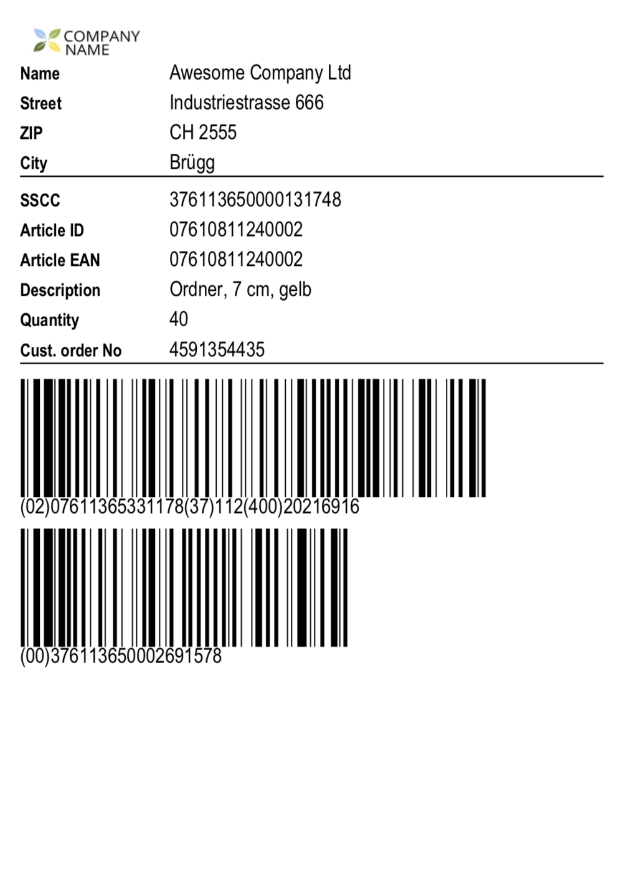

# templator
Simple templating engine for generating printouts (labels, invoices, etc) in PDF or SVG

.Net Core 2.2

You can turn this:
``` XML
<?xml version="1.0" encoding="UTF-8"?>
<Template IsDebug="false">
    <PageSettings Format="A5" Orientation="Portrait" Margin="5" />
    <ReportBody>
        <Column>
            <Iterator ItemReferenceName="i" DataField="Rows">
                <Column>
                    <Image Src="logo.png" Width="90" Height="30" />
                    <Line />
                    <Field DataField="CustomerName" />
                    <Field DataField="CustomerStreet" />
                    <Row>
                        <Label Text = "City" Width="28" />
                        <Value DataField="CustomerZip" FontStyle="Bold" Width="16" />
                        <Value DataField="CustomerCity" FontStyle="Bold" />
                    </Row>
                    <Line />
                    <Field DataField="i.SsccNo" />
                    <Field DataField="i.ArticleId" />
                    <Field DataField="i.ArticleEan" />
                    <Field DataField="i.ArticleDescription" Lines="2" />
                    <Field DataField="i.Quantity" ValueAlign="Left" />
                    <Field DataField="CustomerReference" />
                    <Line />
                    <Barcode Type="GS1-128" DataField="i.Barcode1" Height="30" Scale="0.4" />
                    <Barcode Type="GS1-128" DataField="i.Barcode2" Height="30" Scale="0.4" />
                </Column>
                <NewPage />
            </Iterator>
        </Column>
    </ReportBody>
</Template>
```
into this:

using this code:
```C#
var data = new Gs1Data
      {
          CustomerName = "Awesome Company Ltd",
          CustomerStreet = "Industriestrasse 666",
          CustomerZip = "CH 2555",
          CustomerCity = "Brügg",
          SsccNo = "376113650000131748",
          ArticleDescription = "Ordner, 7 cm, gelb",
          ArticleId = "07610811240002",
          ArticleEan = "07610811240002",
          CustomerReference = "4591354435",
          Quantity = 40,
          Barcode1 = "(02)07611365331178(37)112(400)20216916",
          Barcode2 = "(00)376113650002691578"
      };

      var cfg = new PdfConfig
      {
          OutFile = "result.pdf",
          FontPaths = new string[] { "/Library/Fonts" } // this is configured for macOS, on windows/linux you have to change it
      };

      Templator.Create("label.xml")
              .UsePdfRenderer(cfg)
              .Render(data);
```
