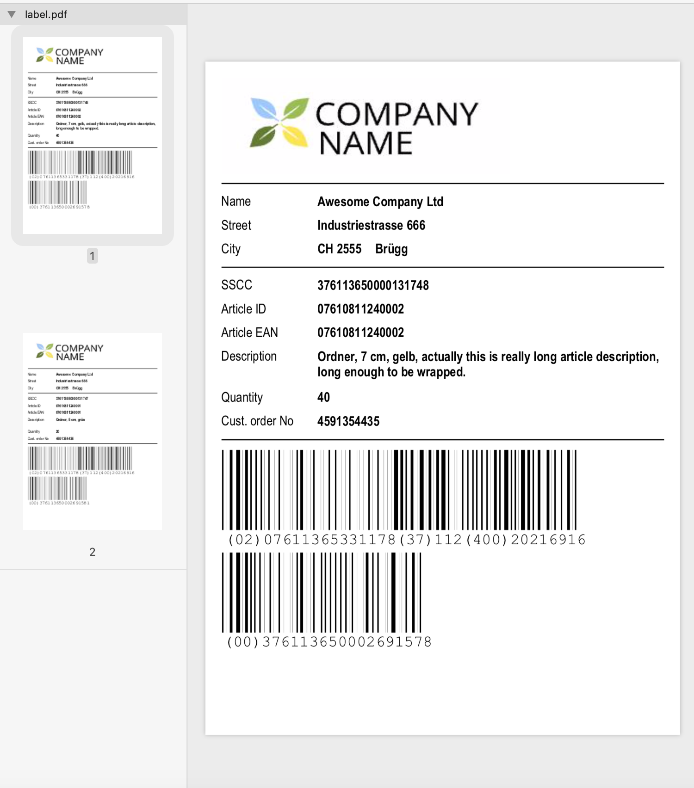

# templator
Simple templating engine for generating printouts (labels, invoices, etc) in PDF or SVG

.Net Core 2.2

You can turn this:
``` XML
<?xml version="1.0" encoding="UTF-8"?>
<Template IsDebug="false">
    <PageSettings Format="A5" Orientation="Portrait" Margin="5" />
    <ReportBody>
        <Column>
            <Iterator ItemReferenceName="i" DataField="Rows">
                <Column>
                    <Image Src="logo.png" Width="90" Height="30" />
                    <Line />
                    <Field DataField="CustomerName" />
                    <Field DataField="CustomerStreet" />
                    <Row>
                        <Label Text = "City" Width="28" />
                        <Value DataField="CustomerZip" FontStyle="Bold" Width="16" />
                        <Value DataField="CustomerCity" FontStyle="Bold" />
                    </Row>
                    <Line />
                    <Field DataField="i.SsccNo" />
                    <Field DataField="i.ArticleId" />
                    <Field DataField="i.ArticleEan" />
                    <Field DataField="i.ArticleDescription" Lines="2" />
                    <Field DataField="i.Quantity" ValueAlign="Left" />
                    <Field DataField="CustomerReference" />
                    <Line />
                    <Barcode Type="GS1-128" DataField="i.Barcode1" Height="30" Scale="0.4" />
                    <Barcode Type="GS1-128" DataField="i.Barcode2" Height="30" Scale="0.4" />
                </Column>
                <NewPage />
            </Iterator>
        </Column>
    </ReportBody>
</Template>
```
into this:

using this code:
```C#
           var data = GetGs1Data();

            var cfg = new PdfConfig
            {
                FontPaths = new []{ "/Library/Fonts" } // this is configured for mac, on windows you have to change it
            };

            var bytes = Templator.Create("Template/label.xml")
                .UsePdfRenderer(cfg)
                .Render(data);
            
            File.WriteAllBytes("Result/label.pdf",bytes);
```
